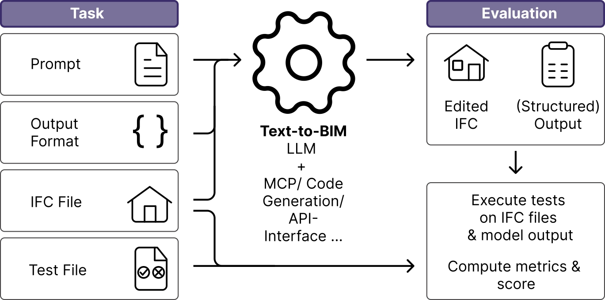

# BIBIMBAP: A Benchmark for Instructional BIM-Based Automated Programming

**BIBIMBAP** is a benchmark framework for systematically evaluating text-to-BIM agents. It provides a standardized pipeline of IFC-based task prompts, configurable agent backends, and automated evaluation - enabling reproducible comparison of LLM-driven approaches to Building Information Modeling.

> This repository accompanies the BIBIMBAP paper. If you use this framework in your research, please cite accordingly.

<p align="center">
  
</p>

**Key capabilities:**

- Multi-provider support (OpenAI, Anthropic, Google) 
- Pluggable agent backends with a minimal interface (`BaseLLMAgent`)
- Task-level evaluation with per-sample scoring and runtime metrics
- Structured results with token usage, tool call traces, and error tracking

<!-- ## Baseline Results

Model performance by category and overall average score (%). Each category contains 20 tasks evaluated across multiple samples.

| Model | Basic (20) | Spatial (20) | Topological (20) | Numeric (20) | Conceptual (20) | Overall Score |
|---|:---:|:---:|:---:|:---:|:---:|:---:|
| Claude Opus 4.5 | 46.3 | **60.8** | 38.8 | **30.0** | 20.0 | **39.2** |
| Gemini 3 Flash | **54.2** | 45.8 | **44.2** | 5.0 | 15.0 | 32.8 |
| GPT-5.2 | 42.5 | 36.0 | 30.0 | 5.0 | **25.0** | 27.7 |
| Claude Sonnet 4.5 | 47.9 | 36.6 | 32.9 | 10.0 | 10.0 | 27.5 |
| GPT-5 Mini | 35.0 | 33.5 | 27.9 | 0.0 | **25.0** | 24.3 |
| GPT-4.1 | 17.5 | 34.2 | 21.7 | 0.0 | 20.0 | 18.7 | -->

## Getting Started

### Installation

```bash
pip install -r requirements.txt
```

### Download Prompts and IFC Files

```bash
python scripts/download_data.py
```

### Configuration

1. Set up environment variables:

```bash
cp configs/.env.example .env
# Edit .env with your API keys
```

2. Select and customize a configuration template:

```bash
cp configs/benchmark.code_agent.example.json configs/benchmark.config.json
# Edit configs/benchmark.config.json as needed
```

### Running a Benchmark

```bash
python benchmark.py --config configs/benchmark.config.json
```

To run only the LLM inference stage (skip evaluation):

```bash
python benchmark.py --config configs/benchmark.config.json --only-llm
# Run evaluation separately:
python scripts/eval_cache.py --run-dir results/run_<timestamp>
```

### Analyzing Results

```bash
python scripts/analyze_results.py --latest
```

To re-evaluate a cached run:

```bash
python scripts/eval_cache.py --run-dir results/run_<timestamp>
```

## Configuration Reference

A benchmark configuration requires the following keys:

| Key                | Description                                        |
|--------------------|----------------------------------------------------|
| `questions_csv`    | Path to the prompt CSV file                        |
| `num_samples`      | Number of samples per task                         |
| `model_name`       | Provider-prefixed model identifier                 |
| `system_prompt`    | System prompt for the agent                        |
| `llm_agent_system` | Agent class reference (`module:ClassName`)         |
| `paths`            | Path configuration for IFC assets and data         |
| `results`          | Output directory configuration                     |

## Extending BIBIMBAP

To add a new agent backend:

1. Create a new module in `llm_agents/`.
2. Inherit from `BaseLLMAgent` and implement the `invoke(prompt, ifc_path, output_format)` method.
3. Reference the new class via `llm_agent_system` in your config.

For detailed guidance, see [docs/agent_guide.md](docs/agent_guide.md) and [docs/repo_guide.md](docs/repo_guide.md).

## License

See [LICENSE](LICENSE) for details.
